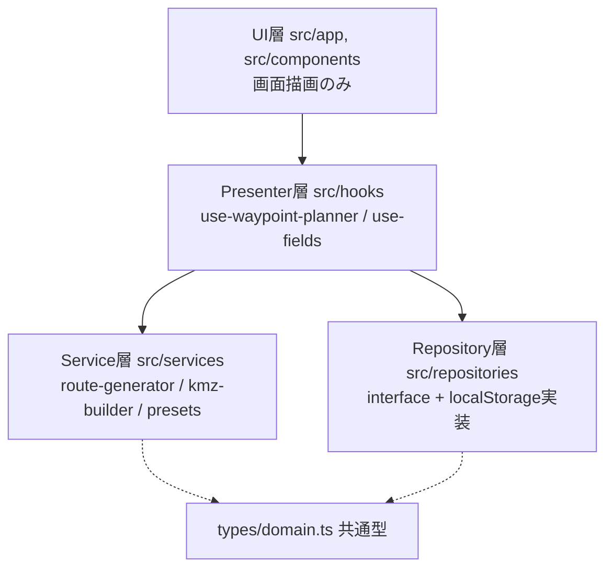

# 圃場ルート — ドローン用ウェイポイント飛行ルート生成PWA

農業従事者が専門知識なしでグリッド飛行ルートを作成できるWebアプリ。
地図上で圃場を描くと、検証済みの撮影設定でDJI Fly用ウェイポイント飛行ファイル
（KMZ）を生成・ダウンロードできる。

**公開URL**: https://akutodazo.github.io/my-waypoint-site/

## できること

- 衛星写真の上に圃場ポリゴンを描く → グリッド飛行経路を自動計算
- 検証済み撮影プリセット（圃場全体20m / 詳細10m / 斜め10m・-60°）をワンタップ適用
- ジンバル角・各点での静止画撮影を含むKMZを生成（DJI Flyの上限200点超過は警告）
- 圃場の保存・呼び出し（同じ圃場を毎回描き直さない）
- PWA: ホーム画面に追加でき、電波の弱い圃場でもオフライン起動

## 使い方

1. 圃場を描く（またはに保存済み圃場を読み込む）
2. プリセットを選ぶ → ルート生成
3. KMZダウンロード
4. DJI Flyへの転送は[転送手順ページ](https://akutodazo.github.io/my-waypoint-site/guide/)参照

## 動作確認済み環境

| 項目    | バージョン           |
| ------- | -------------------- |
| 機体    | （実地検証後に記入） |
| DJI Fly | （実地検証後に記入)  |
| 確認日  | （実地検証後に記入） |

> **注意**: KMZの上書き転送はDJI非公式の手法です。アプリ更新で動作しなくなる
> 可能性があります。飛行は航空法の範囲内（日中・目視内・150m未満・第三者上空
> の回避）で行ってください。

## 技術構成

Next.js (App Router) / TypeScript / Tailwind CSS / Leaflet + leaflet-draw /
Turf.js / JSZip / Jest (38 tests) / GitHub Actions (CI + Pages自動デプロイ)



## 設計判断（なぜこうしたか）

| 判断                                         | 理由                                                                                          |
| -------------------------------------------- | --------------------------------------------------------------------------------------------- |
| 4層構造（UI/Presenter/Service/Repository）   | 変更箇所を1か所に閉じ込めるため。UI全面改修でもロジックとテストが無傷だった実績               |
| 経路計算・KMZ生成を純粋関数に                | 「座標in→座標out」で機械採点できる。テスト38本の大半がここ                                    |
| テストの正解データに本物のDJI Fly製KMZを使用 | 「DJIが読める形式か」を仕様書ではなく実物で保証するため                                       |
| 圃場保存はlocalStorage（interfaceで抽象化）  | 現段階はサーバー不要・費用ゼロ。共有機能導入時はimplementations追加だけでDB移行できる契約設計 |
| 静的書き出し + GitHub Pages                  | サーバーレスで運用費ゼロ。個人開発の持続性を優先                                              |
| UIは白背景固定・大型ボタン                   | 利用場面が直射日光下のスマホのため。視認性は色よりサイズと太さで作る                          |
| ひな型KMZの複製方式（1から生成しない）       | DJIの未公開仕様（missionConfig等）を壊さず引き継ぐため                                        |

## 開発

```bash
npm run dev      # 開発サーバー
npm test         # テスト（38本）
npm run lint     # ESLint
npm run format   # Prettier整形
npm run build    # 本番ビルド（型チェック込み）
```

- 設計規約: [ARCHITECTURE.md](ARCHITECTURE.md)（プロジェクト非依存・持ち出し可）
- プロジェクト固有知識・開発の歩み: [CLAUDE.md](CLAUDE.md)
- mainへのマージで自動デプロイ。開発は feature/* ブランチ + PR

## 背景

アオタケプロジェクト「圃場を、空から見える化する」の中核ツール。
北海道・更別村の畑作現場の課題（見回り負担・共同収穫の意思決定）から生まれた。
